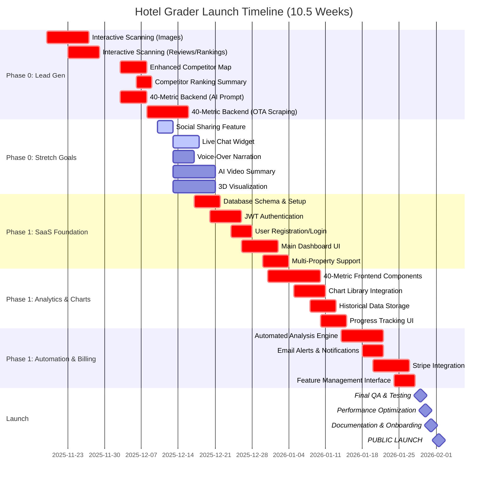

# Hotel Grader - Visual Timeline & Roadmap

**Plan Date:** November 19, 2025
**Launch Date:** February 1, 2026
**Post-Launch:** February - July 2026

---

## Chart 1: Pre-Launch Timeline (Nov 19, 2025 → Feb 1, 2026)

### 10.5 Week Sprint to Launch



**Legend:**
- 🔴 **Critical Path** (red bars) - Core features required for launch
- 🟢 **Stretch Goals** (green bars) - Optional enhancements if ahead of schedule
- 🔷 **Milestones** (diamonds) - Key checkpoints

---

## Chart 2: Post-Launch Roadmap (Feb - Jul 2026)

### 6-Month Growth & Expansion Plan

```mermaid
gantt
    title Post-Launch Product Roadmap (3-6 Months)
    dateFormat YYYY-MM-DD

    section Q1 2026 (Feb-Apr): Foundation
    Multi-Tenant Architecture               :q1_1, 2026-02-03, 20d
    Team Collaboration Features             :q1_2, 2026-02-10, 20d
    iOS Mobile App Development              :q1_3, 2026-02-03, 30d
    Android Mobile App Development          :q1_4, 2026-02-10, 30d
    Competitor Price Alerts                 :q1_5, 2026-03-01, 12d
    Ranking Change Notifications            :q1_6, 2026-03-08, 13d

    section Q2 2026 (May-Jul): Intelligence
    AI Recommendations Engine               :q2_1, 2026-05-01, 17d
    Priority Scoring System                 :q2_2, 2026-05-12, 10d
    Opera PMS Integration                   :q2_3, 2026-05-01, 20d
    Mews PMS Integration                    :q2_4, 2026-05-15, 15d
    Booking.com API Integration             :q2_5, 2026-05-22, 15d
    White-Label Reports                     :q2_6, 2026-06-01, 15d
    Custom Branding System                  :q2_7, 2026-06-10, 15d
    Predictive Analytics Model              :q2_8, 2026-06-15, 20d

    section Q3 2026 (Future): Advanced
    Automated Social Posting                :q3_1, 2026-08-01, 25d
    A/B Testing Platform                    :q3_2, 2026-08-15, 20d
    Internationalization (ES/FR)            :q3_3, 2026-09-01, 30d
    Partner/Referral Program                :q3_4, 2026-09-15, 25d
    Enterprise Tier Launch                  :milestone, 2026-10-01, 1d

    section Revenue Milestones
    Month 3: $5K MRR Target                 :milestone, rev_1, 2026-05-01, 1d
    Month 6: $25K MRR Target                :milestone, rev_2, 2026-08-01, 1d
    Month 12: $75K MRR Target               :milestone, rev_3, 2026-02-01, 1d
```

**Quarterly Breakdown:**

| Quarter | Focus | Investment | Revenue Target |
|---------|-------|------------|----------------|
| **Q1 2026** (Feb-Apr) | Foundation: Multi-tenant, Mobile apps, Alerts | $30-50K | $5K MRR |
| **Q2 2026** (May-Jul) | Intelligence: AI, Integrations, Predictive | $50-80K | $25K MRR |
| **Q3 2026** (Aug-Oct) | Scale: Social, i18n, Enterprise | $80-120K | $50K MRR |

---

## Alternative Visual: Week-by-Week Calendar View

### Pre-Launch Sprint (Nov 19 → Feb 1)

| Week | Dates | Core Focus | Stretch Goals | Milestone |
|------|-------|------------|---------------|-----------|
| **1** | Nov 19-25 | Interactive Scanning: Images | Social Sharing | - |
| **2** | Nov 26-Dec 2 | Interactive Scanning: Reviews/Rankings | Live Chat | ✅ **Live Demo Ready** |
| **3** | Dec 3-9 | Enhanced Map + 40-Metric Backend | Voice-Over | - |
| **4** | Dec 10-16 | Competitor Summary + OTA Scraping | Video Summary | ✅ **Phase 0 Complete** |
| **5** | Dec 17-23 | Database + JWT Auth | - | - |
| **6** | Dec 24-30 | Dashboard + Multi-Property | - | ✅ **SaaS Foundation** |
| **7** | Dec 31-Jan 6 | 40-Metric Frontend + Charts | - | - |
| **8** | Jan 7-13 | Historical Tracking + Progress UI | - | ✅ **40-Metric Live** |
| **9** | Jan 14-20 | Automated Analysis Engine | - | - |
| **10** | Jan 21-27 | Stripe Billing + Feature Mgmt | - | ✅ **Production Ready** |
| **10.5** | Jan 28-Feb 1 | Final QA + Launch Prep | - | 🚀 **LAUNCH FEB 1** |

**Total Hours:** ~200 hours (18-22 hrs/week average)

---

## Post-Launch Feature Timeline

```
FEBRUARY 2026                    MARCH 2026                      APRIL 2026
─────────────────────────────────────────────────────────────────────────────
│ Multi-Tenant Arch    │ Team Collab         │ Mobile Testing    │
│ iOS App Start        │ iOS App Beta        │ iOS App Launch    │
│                      │ Android App Start   │ Android Beta      │
│                      │ Competitor Alerts   │ Alert Refinement  │
└──────────────────────┴─────────────────────┴───────────────────┘
        $5K MRR Target →

MAY 2026                         JUNE 2026                       JULY 2026
─────────────────────────────────────────────────────────────────────────────
│ AI Recommendations   │ Priority Scoring    │ Refinement        │
│ Opera Integration    │ Mews Integration    │ Booking.com API   │
│ White-Label Start    │ White-Label Beta    │ WL Launch         │
│                      │ Predictive Model    │ Model Training    │
└──────────────────────┴─────────────────────┴───────────────────┘
                                    $25K MRR Target →

AUGUST 2026+
─────────────────────────────────────────────────────────────────────────────
│ Social Automation    │ A/B Testing         │ Internationalization │
│ Partner Program      │ Enterprise Tier     │ Revenue Optimization │
└──────────────────────┴─────────────────────┴──────────────────────┘
                                                    $50K+ MRR Target →
```

---

## Critical Path Dependencies

### Pre-Launch (Must Complete in Order):
```
1. Interactive Scanning ─────→ 2. Enhanced Map ─────→ 3. 40-Metric Backend
                                                             ↓
                                                    4. Database & Auth
                                                             ↓
                                                    5. Dashboard UI
                                                             ↓
                                                    6. Historical Tracking
                                                             ↓
                                                    7. Billing Integration
                                                             ↓
                                                    8. LAUNCH 🚀
```

### Parallel Tracks (Can Build Simultaneously):
```
Track A: Frontend (React/TypeScript)
├── Interactive Scanning UI
├── 40-Metric Components
├── Dashboard Layout
└── Chart Visualizations

Track B: Backend (Python/Flask)
├── Database Schema
├── Authentication APIs
├── Analysis Engine
└── Billing Webhooks

Track C: Integrations
├── Google Maps API
├── OTA Scraping
├── Stripe Setup
└── Email Automation
```

---

## Risk Buffer & Contingency

**Built-in Buffer:** 15-20% time cushion in estimates

| Phase | Planned | Buffer | Total |
|-------|---------|--------|-------|
| Phase 0 | 80h | +15h | 95h |
| Phase 1 | 120h | +20h | 140h |
| **Total** | **200h** | **+35h** | **235h** |

**If Behind Schedule:**
1. Defer all stretch goals (save 15-25 hours)
2. Simplify 40-metric UI (save 10 hours)
3. Reduce chart complexity (save 5 hours)
4. Launch with Free plan only, add paid later (save 15 hours)

**If Ahead of Schedule:**
1. Add top 2 stretch goals (Social Sharing + Live Chat)
2. Polish UI/UX animations
3. Create marketing materials
4. Build email drip campaigns
5. Conduct beta user testing

---

## Success Indicators by Week

| Week | What Success Looks Like |
|------|------------------------|
| **Week 2** | Live demo shows images/reviews during scan |
| **Week 4** | Full 40 metrics display with mock data |
| **Week 6** | Users can register, login, add properties |
| **Week 8** | Historical charts show data over time |
| **Week 10** | Successful test payment processed |
| **Week 10.5** | Zero critical bugs, all tests pass, launch ready |

---

**Notes:**
- Charts created using Mermaid syntax (renders on GitHub, GitLab, many markdown viewers)
- Dates are estimated based on November 19, 2025 start
- Red/critical items are must-haves; green/active items are optional stretch goals
- Post-launch timeline assumes successful Feb 1 launch and funding availability
